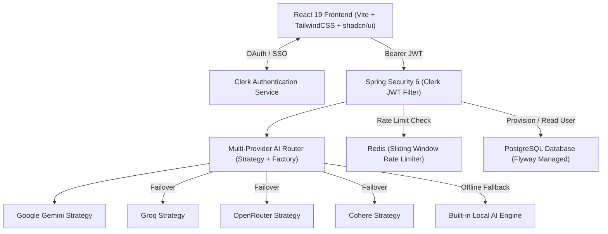

<div align="center">

# ✨ ResuMate

### Enterprise-Grade AI Resume Builder & Career Accelerator (SaaS)

[](https://oracle.com/java)
[](https://spring.io/projects/spring-boot)
[](https://react.dev)
[](https://clerk.com)
[](https://postgresql.org)
[](https://redis.io)
[](LICENSE)

**Transform plain-text job descriptions into recruiter-tested, ATS-optimized resumes with AI multi-provider failover.**

[🚀 Live Demo](https://resumate-ai.vercel.app) · [📖 Features](#-key-features) · [🏗 Architecture](#-architecture) · [💻 Getting Started](#-getting-started)

---

</div>

## 📌 Executive Summary

**ResuMate** is a production-grade AI SaaS application engineered with modern architectural patterns. Designed for high availability, security, and scalability, it combines a **Java 21 Spring Boot microservice backend** with a **React 19 single-page frontend**.

Key technical capabilities include a **Multi-Provider AI Router** with circuit breaker and failover (Gemini, Groq, OpenRouter, Cohere), **Clerk JWT Authentication** with auto-user provisioning, **Redis Sliding Window Rate Limiting**, and **Flyway PostgreSQL schema migrations**.

---

## ✨ Key Features

| Feature | Architectural Implementation |
|---|---|
| 🤖 **Multi-Provider AI Engine** | Strategy & Factory pattern routing across Google Gemini, Groq, OpenRouter, Cohere with circuit breaker and fallback. |
| 🛡️ **Clerk Auth & Spring Security** | Stateless JWT validation filter on Spring Security 6, automatically provisioning PostgreSQL user records. |
| ⚡ **Redis Rate Limiting** | Sliding-window rate limiting tracking daily generation, section improvement, and ATS check quotas. |
| 🎯 **Target Resume Builder** | Tailors existing resume content directly against target job descriptions for high relevance. |
| 📊 **ATS Score Engine** | Algorithmic breakdown evaluating keyword matching, typography, formatting, and structural metrics. |
| 🖼️ **4 Recruiter Templates** | Harvard Classic, Academic Clean, Sidebar Pro, and Timeline Pro — all fully ATS-compliant. |
| 📄 **Multi-Format Export** | Client-side pixel-perfect A4 PDF, Word (`.docx`), and Markdown (`.md`) generation. |
| 🗄️ **Flyway DB Migrations** | Versioned SQL DDL managing `users`, `plans`, `resumes`, `usage_records`, and `ai_request_logs`. |

---

## 🏗 System Architecture



---

## 🛠️ Tech Stack

### Backend
- **Java 21 LTS** — Core language runtime
- **Spring Boot 3.4+** — REST API framework
- **Spring Security 6** — Stateless authentication & CORS control
- **Spring Data JPA & Flyway** — ORM and database migrations
- **Spring Data Redis** — Rate-limiting & sliding window cache
- **JJWT & Jackson** — JWT validation and JSON processing

### Frontend
- **React 19** — Component library and state management
- **Vite 7** — Next-gen frontend toolchain
- **TailwindCSS 3.4 & DaisyUI** — Design system and utility styling
- **@clerk/clerk-react** — User authentication & SSO components
- **jsPDF & html-to-image** — High-resolution client-side PDF renderer
- **docx** — Native Word document generation
- **Lucide React & Sonner** — Icons and notifications

---

## 🚀 Getting Started

### Prerequisites
- **Node.js** $\ge 18$
- **Java JDK** 21 LTS
- **Maven** 3.9+ (or included `./mvnw`)
- **Docker / PostgreSQL & Redis** (Optional: defaults to in-memory H2/Redis fallback for instant local dev)

---

### 1. Clone the Repository
```bash
git clone https://github.com/hxrshityadav/ResuMate.git
cd ResuMate
```

---

### 2. Backend Setup
```bash
cd Backend

# Run local build & start server
./mvnw spring-boot:run
```
The backend server runs on `http://localhost:8080`.

#### Environment Configuration (`Backend/src/main/resources/application.properties`)
```properties
# Server
server.port=8080

# AI Provider API Keys
gemini.api.key=${GEMINI_API_KEY:}
groq.api.key=${GROQ_API_KEY:}
openrouter.api.key=${OPENROUTER_API_KEY:}
cohere.api.key=${COHERE_API_KEY:}

# Clerk Authentication
clerk.issuer-uri=https://clerk.your-domain.com
```

---

### 3. Frontend Setup
```bash
cd Frontend

# Install dependencies
npm install

# Start Vite dev server
npm run dev
```
The frontend application opens on `http://localhost:5173` (or `http://localhost:5175`).

#### Environment Configuration (`Frontend/.env`)
```env
VITE_API_BASE_URL=http://localhost:8080/api/v1
VITE_CLERK_PUBLISHABLE_KEY=pk_test_YOUR_CLERK_PUBLISHABLE_KEY
```

---

## 📡 API Reference

All backend REST endpoints are protected and prefixed with `/api/v1/resume`:

### 1. Generate Resume
```http
POST /api/v1/resume/generate
Authorization: Bearer <clerk_jwt_token>
Content-Type: application/json

{
  "userDescription": "Full Stack Engineer with 3 years of React and Spring Boot experience."
}
```

### 2. Improve Resume Section
```http
POST /api/v1/resume/improve-section
Authorization: Bearer <clerk_jwt_token>
Content-Type: application/json

{
  "sectionType": "summary",
  "content": "Experienced developer building web apps."
}
```

### 3. ATS Score Analysis
```http
POST /api/v1/resume/ats-check
Authorization: Bearer <clerk_jwt_token>
Content-Type: application/json

{
  "resumeText": "Full text content of resume...",
  "jobDescription": "Target job description..."
}
```

---

## 🗄 Database Schema (Flyway V1)

```sql
CREATE TABLE users (
    id UUID PRIMARY KEY,
    clerk_id VARCHAR(255) UNIQUE NOT NULL,
    email VARCHAR(255) UNIQUE NOT NULL,
    full_name VARCHAR(255),
    plan_type VARCHAR(50) DEFAULT 'FREE',
    created_at TIMESTAMP WITH TIME ZONE DEFAULT CURRENT_TIMESTAMP
);

CREATE TABLE resumes (
    id UUID PRIMARY KEY,
    user_id UUID REFERENCES users(id) ON DELETE CASCADE,
    title VARCHAR(255) NOT NULL,
    content JSONB NOT NULL,
    ats_score INT DEFAULT 0,
    created_at TIMESTAMP WITH TIME ZONE DEFAULT CURRENT_TIMESTAMP
);
```

---

## 🤝 Contributing

Contributions are welcome! Follow these steps:
1. Fork the repository
2. Create your feature branch (`git checkout -b feature/amazing-feature`)
3. Commit your changes (`git commit -m 'feat: Add amazing feature'`)
4. Push to the branch (`git push origin feature/amazing-feature`)
5. Open a Pull Request

---

## 📄 License

Distributed under the MIT License. See `LICENSE` for more information.

<div align="center">

**Built with ❤️ by [Harshit Yadav](https://github.com/hxrshityadav)**

</div>
